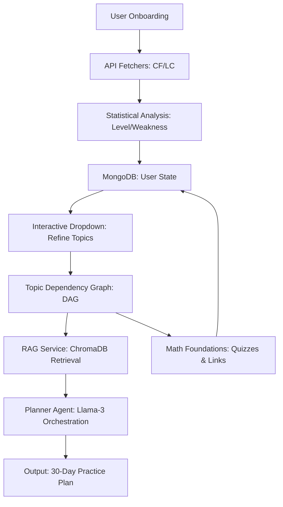

# System Design: AI CP/DSA Planner 

This document outlines the architecture and workflows of the CP Planner AI, explaining how it combines user data, vector search, and LLM-powered agents to create personalized training paths.

## 1. High-Level Architecture

The system is built as a modular Streamlit application with three core layers:
- **Data Ingestion Layer**: Fetches live statistics from Codeforces and LeetCode.
- **Intelligence Layer**: Uses a Dependency Graph and a RAG (Retrieval-Augmented Generation) system.
- **Execution Layer**: A Planner Agent that builds and optimizes the 30-day curriculum.

## 2. The Intelligence Loop

### A. Weakness Detection
The system analyzes submission history. Any topic with a success rate below 40% or marked as "Untouched" is flagged. This ensures the plan is grounded in objective data, not just user intuition.

### B. Topic Dependency Graph (DAG)
DSA topics aren't isolated. You can't master Graphs without understanding BFS/DFS. Our internal DAG ensures that if a user is weak in "Segment Trees," the system automatically schedules "Trees" and "Arrays" as prerequisites.

### C. RAG System (Retrieval-Augmented Generation)
We use ChromaDB to store thousands of competitive programming problems.
1. **Query**: The Planner Agent requests problems for a specific topic (e.g., "Dynamic Programming") at a specific difficulty (e.g., "1600 rating").
2. **Retrieval**: ChromaDB finds the most semantically relevant problems.
3. **Filtering**: The system filters out problems the user has already solved (tracked via `solvedLinks` in MongoDB).

## 3. The Planner Agent (Groq / Llama-3)
The agent acts as the orchestrator. It doesn't just list problems; it:
- Generates a "Why" for every topic, explaining its importance for the user's current level.
- Balances the 30-day schedule so the user doesn't burn out.
- Generates interactive quizzes on the fly for the "Math Foundations" page to verify mastery.

## 4. Technology Stack
- **Frontend**: Streamlit
- **Database**: MongoDB (User state), ChromaDB (Vector storage)
- **LLM**: Llama-3.3-70B via Groq API
- **APIs**: Codeforces API, LeetCode GraphQL
